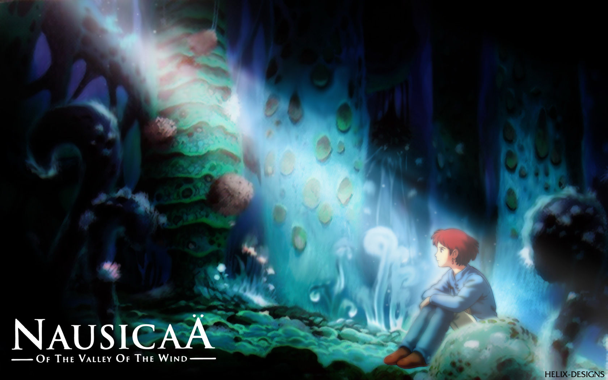

 During the June heatwave, I took an 8-hour train that was thankfully air-conditioned, on time, and very comfortable—thanks České dráhy! The first half of that fiery, disgusting day had sucked me dry of any hint of energy (for an accurate visual representation, I refer readers to [an iconic Indian TV ad from maybe the 2000s](https://www.youtube.com/watch?v=HMRcFS35Mv8)). And there was a huge group of teenagers just in front of me, so I needed to be properly distracted in order to keep the already-twitching crankiness dial under control. So, I scrolled the usual apps for something to watch: something engrossing, but light and not very demanding. Netflix seemed to have a lot of the Miyazaki x Ghibli movies—I'm a fan, but I haven't watched them all. I landed on Nausicaä of the Valley of the Wind. 

 

Reader. I was settling in for what I thought would be a relately calm fantasy movie: sweet, thoughtful, and at least a little unnerving. You know, like Totoro or The Boy and the Heron. I didn't know I was about to be smacked in the face by a pacy, allegorical *thriller*. I beg you to watch it; this movie does not have a dull moment. What it has got in bucketfuls is just. So. Much. Heart. It's full of intense action, wild innovations, and a lot of attention to aesthetics, but none of that encroaches on its warm core of empathy and love. We've seen so often how easy it is for movies to get so lost in technical delights that they turn into empty shows of self-indulgence (ahem, disclosure day anyone?). Not here. You will be hypnotised by glimmering blue-green fantasy forests, encounter creatures straight out of nightmares (ah, and the most adorable *fox-squirrel*, which I am convinced just modelled off of a feisty kitten), and hold your breath through mythic battles. But the entire time, you will feel so many things in ways you wouldn't have expected—for Nausicaä, for the many murderous beings, for their world, and for ours. I learned later that this was just Miyazaki's second directorial venture, coming out before Studio Ghibli was officially formed. What a start!

-- 
P.S.: If you wondered why the name is written like that, it's because it comes from the Odyssey. The two dots in are not an umlaut, but a *diaeresis*: a way of marking a vowel hiatus taken from Greek, where it's called a *trema*. It's archaic and very uncommon in English, but you'll see it with some regularity if you read the New Yorker. And [some readers take time out of their day complain about it](https://www.newyorker.com/culture/culture-desk/the-curse-of-the-diaeresis). 