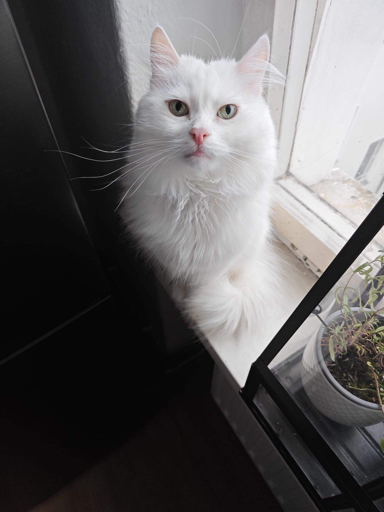
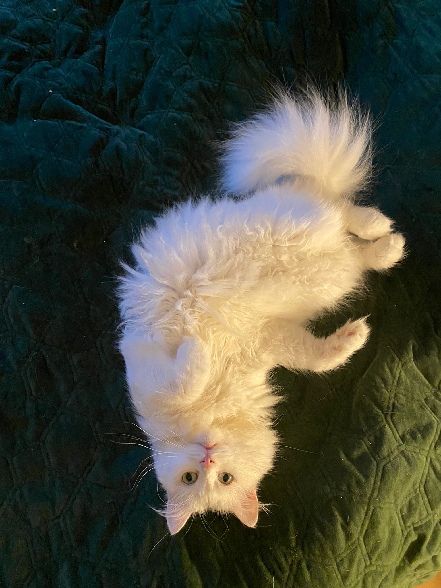
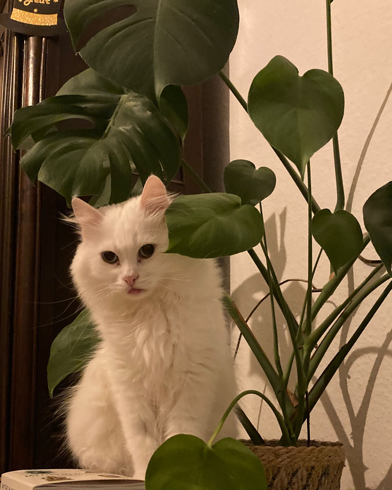
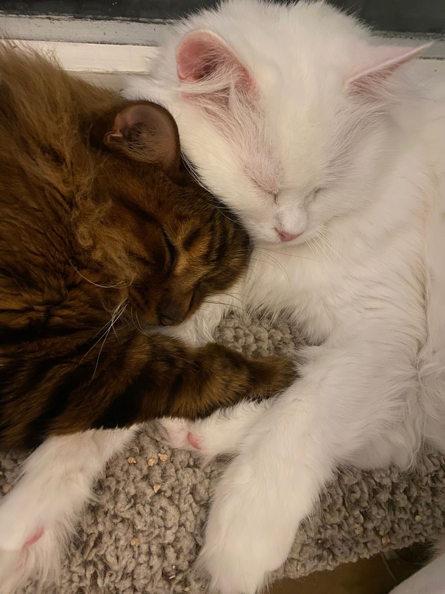
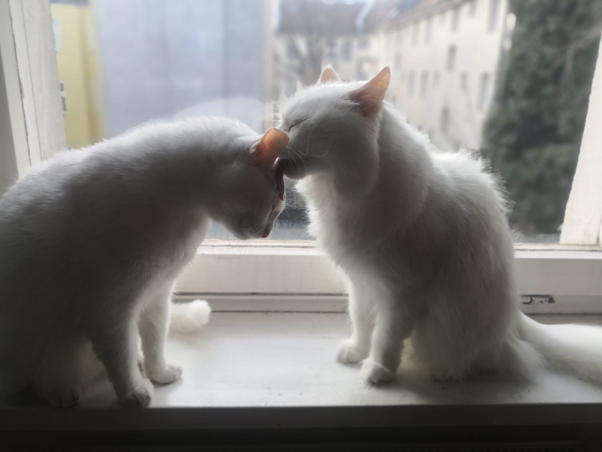

 
 Boni has been with us since 2022, when he and Dani came to Germany with their family who fled the war in Ukraine. The vets estimate that he was born in 2016--we don't know for sure, since his Ukrainian family had found him on the streets, gray and scraggly. Now he lives his best life chasing ribbons at the speed of light, raising his adoptive brother Rüdi, and showering us with more love than we will ever deserve. 
 
 Boni is genuinely the coolest, smartest, most emotionally intelligent cat we have ever met. He is also an absolute charmer who is always down to socialise: he has collected a fanbase across the city consisting of everyone who has interacted with him. We like to say that he is a human trapped in a cat body because of how expressive he can be! 

(We did not come up with the sassy name!! His original family did that, and we thought it somehow fits...)

<!--  -->

