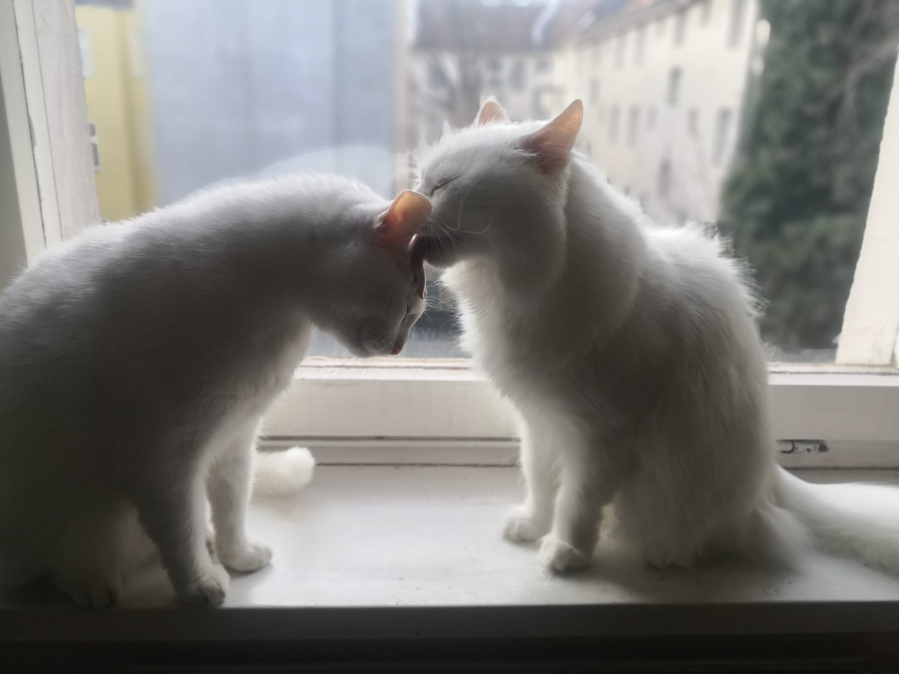

Dani came to us with Boni in 2022. We got to spend two years full of cuddles and purrs with him, until he succumbed to an aggressive renal cancer in 2024, at the age of 10. He lived his life following one primary goal: maximising the time that he can spend in direct physical contact with a human. Of course, we were very happy to oblige. He would sleep curled up inside my blanket; he would insert himself into every zoom meeting, not understanding why our hands were on a keyboard and not on his fur; and every time we walked through the door after being outside, he would throw himself onto the floor with a loud thud to present his belly for rubs. He was full of warmth and trust to the very end, accepting infusions and medicines with little fuss and being incredibly brave. We miss him a lot. 

