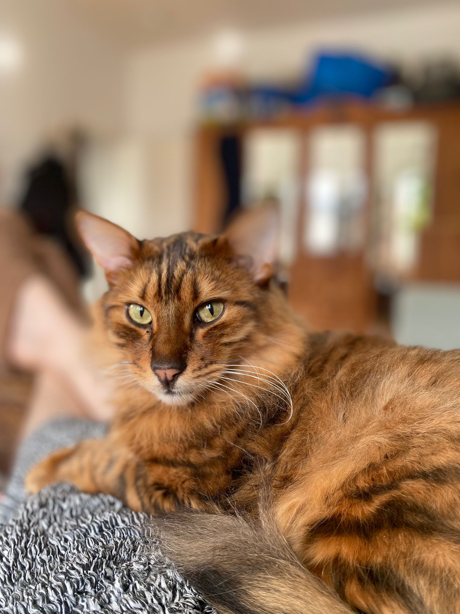
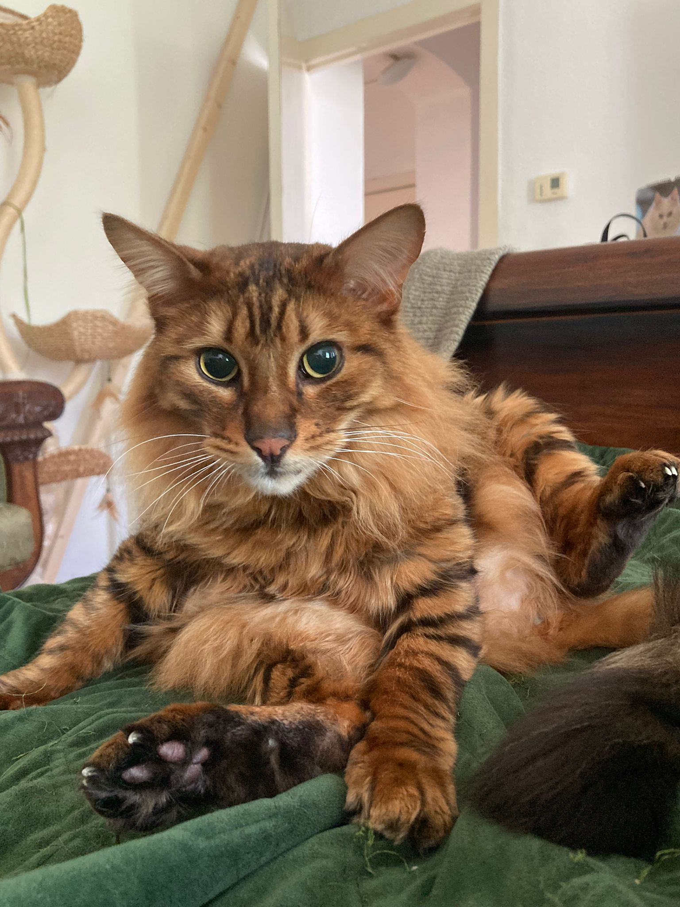

 His Majesty was born in 2018 and has been with us since mid-2024. His previous owner had given him up to the shelter, where he was looking for a home with a friendly companion. Around the same time, *we* went looking for a friendly companion for Boni, who was lonely after his original adoptive sibling, Dani, passed away. Rüdi has been through a lot with his health: he had gone (irrevocably) blind for unknown reasons about a year before we adopted him, and continued to have a range of GI issues to fight through. But we braved it together, and a year later, he is a fit, strong, and curious boy whose attention-seeking meows can be heard across the street. And although he is a LARGE cat, he is a little princess baby at heart who has the whole household, including Boni, at his service! 

Oh, and if you're wondering about his impressive appearance: it's because he is a purebred designer cat (a toyger). His long hair is a mutant accident, apparently. He came with his first name from his original owner---the second was our addition for sass, chosen because the shelter believed he could see shadows :3 

